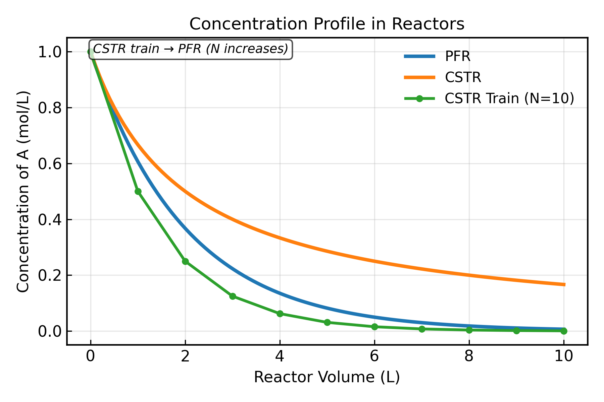
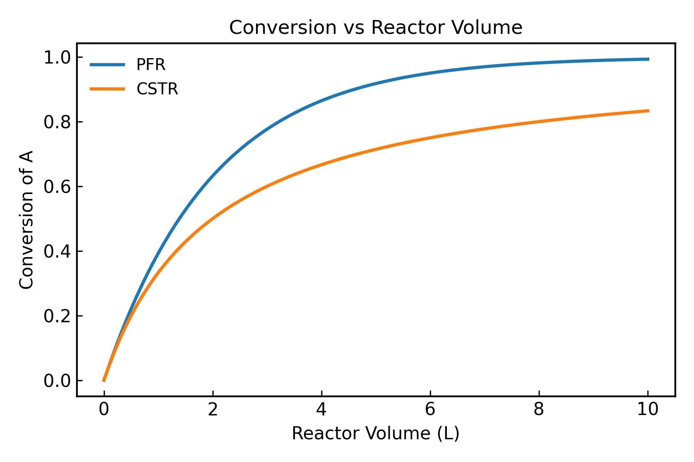
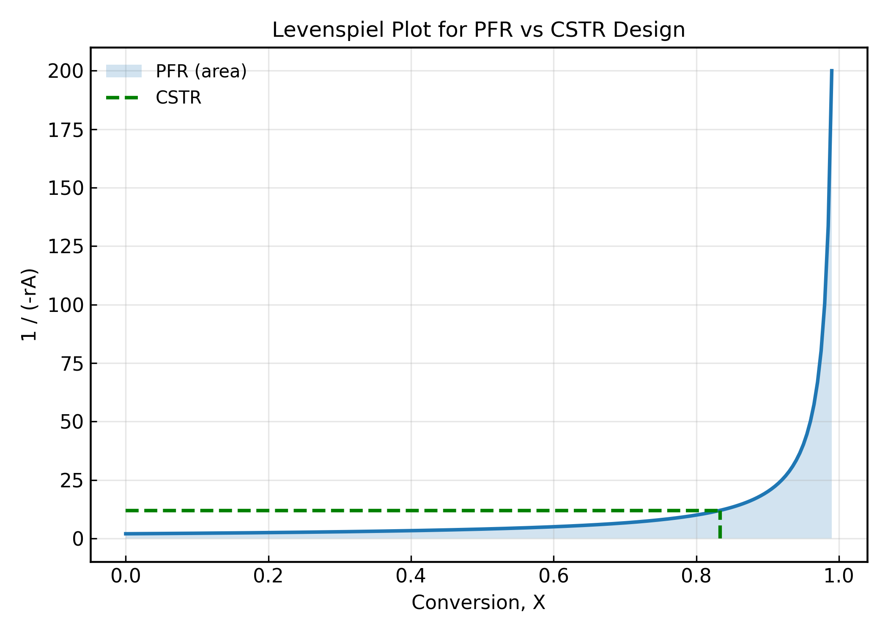

# Chemical Reactor Simulation Tool


<p align="center">
  
</p>

<p align="center">
Concentration profile of reactant A across PFR, CSTR, and CSTR train models.
</p>

---

A Python-based simulation of ideal chemical reactors used in chemical reaction engineering.  

The project models **Plug Flow Reactors (PFR)**, **Continuous Stirred Tank Reactors (CSTR)**, and **CSTR trains**, and visualizes reactor behavior using engineering plots such as concentration profiles, conversion curves, and Levenspiel diagrams.

This project demonstrates how core chemical engineering reactor design equations can be implemented using numerical methods and scientific computing in Python.

---

# Overview

Chemical reactors are fundamental units in chemical engineering used to convert reactants into products. Different reactor designs lead to different performance characteristics.

This simulation models and compares three ideal reactor configurations:

• Plug Flow Reactor (PFR)  
• Continuous Stirred Tank Reactor (CSTR)  
• CSTR train (series of CSTRs approximating a PFR)

The model solves the governing reactor equations numerically and visualizes concentration profiles, conversion, and reactor design relationships.

---

# Reaction System

Reaction:

A → B

First-order reaction kinetics:

r_A = -k · C_A

Where:

- r_A = reaction rate (mol/L·s)
- k = rate constant (1/s)
- C_A = concentration of species A (mol/L)

---

# Reactor Models

## Plug Flow Reactor (PFR)

The PFR design equation:

dFA / dV = r_A

For constant volumetric flow rate:

dCA / dV = r_A / v0

This differential equation is solved numerically using SciPy.

---

## Continuous Stirred Tank Reactor (CSTR)

For a steady-state CSTR:

F_A0 - F_A + r_A · V = 0

Which can be written in terms of concentration:

C_A = C_A0 - ((-r_A · V) / F_A0)

The outlet concentration is obtained by solving the algebraic design equation.

---

## CSTR Train

A CSTR train approximates plug flow behavior through a series of stirred tanks.

Each reactor uses the outlet concentration from the previous reactor as its inlet concentration:

C_Aₙ₊₁ = CSTR(C_Aₙ)

As the number of tanks increases, the system approaches PFR performance.

---

# Engineering Outputs

The simulation generates the following outputs:

• Concentration profiles along reactor volume  
• Conversion profiles along reactor volume  
• Levenspiel diagram for reactor sizing  
• Comparison of PFR, CSTR, and CSTR train behavior  

Example outputs are included in the `example_plots/` folder.

---

## Example Model Outputs

<p align="center">

</p>

<p align="center">
Conversion of reactant A along reactor volume for PFR and CSTR models.
</p>

<p align="center">

</p>

<p align="center">
Levenspiel diagram comparing reactor volume requirements for PFR and CSTR systems.
</p>

---

# Levenspiel Diagram

The Levenspiel diagram is used to compare reactor performance and determine reactor sizing for PFR and CSTR systems:

F_A0 / (-r_A) vs. conversion (X)

This allows direct comparison of reactor sizing requirements:

• Area under the curve → required PFR volume  
• Rectangle area → required CSTR volume  

The simulation illustrates how reactor type affects required reactor volume for a given conversion.

---

# Project Structure

```
chemical-reactor-simulation-tool
│
├── main.py
├── reactor_model.py
├── plotting.py
├── parameters.py
├── requirements.txt
├── README.md
│
└── example_plots/
    ├── concentration_plot.png
    ├── conversion_plot.png
    └── levenspiel_plot.png
```

---

# Installation

### Clone the repository

```
git clone https://github.com/MatthewNguyen865/chemical-reactor-simulation-tool.git
```

### Install dependencies

```
pip install -r requirements.txt
```

### Run the simulation

```
python main.py
```

---

# Technologies Used

• Python  
• NumPy  
• SciPy  
• Matplotlib  

---

# Skills Demonstrated

## Chemical Engineering

• Reactor design equations  
• Reaction kinetics modeling  
• Levenspiel analysis  
• Comparison of ideal reactor types  

## Programming

• Scientific computing in Python  
• Numerical solution of differential equations  
• Data visualization  
• Modular project structure

---

## Project Evolution

This project began as a Plug Flow Reactor (PFR) simulation solving a first-order reaction using numerical methods. It was later extended to include a Continuous Stirred Tank Reactor (CSTR) and a CSTR train model to compare ideal reactor behaviors. A Levenspiel diagram was added to connect simulation results with standard reactor design concepts.

---

# Future Improvements

Potential extensions for the simulator:

• Higher-order and multiple reaction systems  
• Temperature-dependent kinetics (Arrhenius equation)  
• Non-isothermal reactor modeling (energy balances)  
• Optimization of reactor volume for target conversion  
• Interactive visualization or GUI interface

---

# Author

Matthew Nguyen  
Chemical Engineering Student  
Texas A&M University